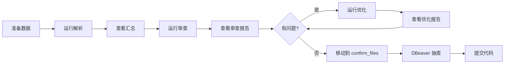

# Excel 数据清洗入仓系统

基于 LLM Agent 驱动的 Excel 数据清洗入仓系统。自动扫描 Excel 文件，通过 LLM 分类表格结构，选择合适的解析策略，将清洗后的数据写入 MySQL 数据库。

---

## 目录

- [环境配置](#环境配置)
- [项目结构](#项目结构)
- [Skills 使用指南](#skills-使用指南)
- [完整工作流程](#完整工作流程)
- [数据库说明](#数据库说明)
- [注意事项](#注意事项)

---

## 环境配置

### 1. 安装 MySQL 8

- 使用安装包安装，**root 密码设为 `123456`**，端口保持默认 `3306`
- **⚠️ 重要**：MySQL 8 默认大小写敏感，需在初始化前在 `my.ini` 中添加：
  ```ini
  [mysqld]
  lower_case_table_names=1
  ```
  > 如果已安装但未设置，需要卸载 MySQL、删除数据目录、修改配置后重新安装
- 安装完成后创建数据库：
  ```sql
  CREATE DATABASE ods_data CHARACTER SET utf8mb4 COLLATE utf8mb4_general_ci;
  ```

### 2. 安装 DBeaver 并连接数据库

| 参数 | 值 |
|------|------|
| 主机 (Host) | `localhost` |
| 端口 (Port) | `3306` |
| 用户名 | `root` |
| 密码 | `123456` |
| 数据库 | `ods_data` |

### 3. 安装 Git 并配置 SSH Key

```bash
# 生成 SSH Key（如已注册 GitHub 可跳过注册步骤）
ssh-keygen -t ed25519 -C "你的邮箱"
cat ~/.ssh/id_ed25519.pub
```
将输出的公钥发给项目管理员，获取仓库权限后克隆项目：
```bash
git clone https://github.com/hurui0309/ExecelDataDeal.git
```

### 4. 安装 CodeBuddy

下载并安装 [CodeBuddy](https://www.codebuddy.ai)，打开后进入编程模式。

### 5. 配置 Python 环境

```bash
# 创建虚拟环境（已被 .gitignore 排除，不会提交）
cd data_to_db
python -m venv .venv
.venv\Scripts\activate        # Windows
pip install -r requirements.txt
```

### 6. 开始工作

每次运行前**先和管理员确认处理哪个文件夹**，然后在 CodeBuddy 中使用以下触发词调用对应 Skill。

---

## 项目结构

```
ExecelDataDeal/
├── data_to_db/                  # 核心解析代码
│   ├── main.py                 # 主入口
│   ├── config.yaml             # 配置文件（数据库/LLM/解析参数）
│   ├── agents/                # Agent 模块
│   │   ├── orchestrator.py    # 编排 Agent：扫描、分发、协调
│   │   ├── classifier.py      # 分类 Agent：LLM 驱动表格结构分类
│   │   └── worker.py         # 工作 Agent：执行解析和入仓
│   ├── services/              # 服务模块
│   │   ├── excel_reader.py   # Excel 数据读取（含合并单元格填充）
│   │   ├── llm_client.py     # LLM API 客户端封装
│   │   ├── mysql_writer.py   # MySQL 建表 + 批量写入
│   │   ├── name_translate.py  # 字段名翻译（LLM 驱动）
│   │   └── table_layout.py   # 表格布局分析
│   ├── strategies/            # 解析策略
│   │   ├── strategy_standard.py          # 标准表策略
│   │   ├── strategy_simple_header.py     # 简单单行表头策略
│   │   ├── strategy_multi_header.py      # 多行表头策略
│   │   ├── strategy_horizontal_split.py  # 水平分表策略
│   │   ├── strategy_vertical_subtable.py # 纵向子表策略
│   │   └── strategy_paired_row_bilingual.py # 双语对照行策略
│   └── logs/                 # 运行日志（不提交 git）
│
├── data/                      # 按场景分类的待处理数据
│   ├── 简单场景_多行表头/
│   ├── 横向分区/
│   └── 纵向多子表/
│
├── confirm_files/             # 验证通过的文件（移入此目录避免重复处理）
│
├── 待清洗数据/               # 原始数据目录（嵌套目录结构，不提交 git）
├── sample_files/             # 抽样测试文件
├── tmp/                      # 临时脚本（debug/test 等，不提交 git）
│
├── review_reports/            # 审查报告（提交 git）
├── optimize_reports/          # 优化报告（提交 git）
│
└── .codebuddy/
    ├── skills/               # 四个核心 Skill
    │   ├── run-parse/       # 运行解析入仓
    │   ├── data-review/      # 落库结果审查
    │   ├── optimize-parse/   # 解析策略优化
    │   └── pipeline/        # 完整流水线
    └── rules/               # 项目规则
```

---

## Skills 使用指南

在 CodeBuddy 编程模式中，直接使用触发词即可调用对应 Skill。

### 1. 运行解析（run-parse）

**触发词**：`运行解析`、`解析文件夹`、`入仓`、`run parse`、`处理数据`

**功能**：拉取最新代码 → 清理旧记录 → 运行 `main.py` 解析指定文件夹 → 汇报结果

**使用方式**：
```
运行解析 data/简单场景_多行表头
```

**执行流程**：
1. `git pull origin feature_codebuddy_20260508` — 拉取最新代码
2. 清理该文件夹对应的 `ods_parse_log` 旧记录
3. `python main.py config.yaml <文件夹路径>` — 执行解析入仓
4. 汇报 SUCCESS / ERROR / SKIP 数量

---

### 2. 审查（data-review）

**触发词**：`审查`、`review`、`检查落库结果`、`数据质量`

**功能**：逐条读取 `ods_parse_log` 记录，对比数据库与 Excel 原始数据，生成 Markdown 审查报告

**使用方式**：
```
审查
```

**执行流程**：
1. `python db_reader.py full_review` — 全量扫描所有 SUCCESS 记录
2. 逐条审查，输出置信度（0.0~1.0）和结论（✅/⚠️/❌/🔍）
3. 对问题记录使用 `auto_compare` 深度审查
4. 生成报告写入 `review_reports/review_YYYYMMDD_HHMMSS.md`

**报告查看**：
```
打开审查报告
```

---

### 3. 优化（optimize-parse）

**触发词**：`优化`、`优化解析`、`fix 解析`、`修复问题`

**功能**：读取最新审查报告 → 归纳问题 → 优化策略代码 → 重新处理 → 验证结果（最多 3 轮迭代）

**使用方式**：
```
优化
```

**执行流程**：
1. 读取 `review_reports/` 下最新报告
2. 归纳问题，修改 `classifier.py` / `strategy_xxx.py` / `name_translate.py` 等
3. 使用 `fix_prepare.py` 准备测试数据
4. 重新运行 `main.py`
5. 使用 `fix_verify.py` 验证结果
6. 生成优化报告 `optimize_reports/optimize_YYYYMMDD_HHMMSS.md`
7. 提交代码到 `feature_codebuddy_20260508` 分支

---

### 4. 流水线（pipeline）

**触发词**：`流水线`、`pipeline`、`完整流程`、`跑一遍`

**功能**：串联上述三个阶段，支持指定运行范围

| 用户意图 | 运行阶段 |
|---------|---------|
| `入库并审查` | 解析 → 审查 |
| `审查并优化` | 审查 → 优化 |
| `流水线` / `完整流程` | 解析 → 审查 → 优化 |

**使用方式**：
```
流水线 处理 data/简单场景_多行表头
```

---

## 完整工作流程



### 详细步骤

1. **准备数据**：将 Excel 文件放入 `data/对应场景文件夹/`

2. **运行解析**：在 CodeBuddy 中说 `运行解析 data/xxx`

3. **查看结果**：说 `汇总结果`，看 SUCCESS/ERROR/SKIP 数量

4. **运行审查**：说 `审查`，自动生成审查报告

5. **查看报告**：说 `打开审查报告`，重点关注 ERROR 和 WARN 项

6. **运行优化**：说 `优化`，基于审查报告自动修复（最多 3 轮）

7. **确认通过**：验证没问题后，将文件移动到 `confirm_files/`

8. **DBeaver 抽查**：`SELECT * FROM 表名 LIMIT 10;` 对照原始 Excel

9. **提交代码**：说 `提交`，自动 push 到 `feature_codebuddy_20260508`

---

## 数据库说明

### ods_parse_log 表

记录每次解析的结果，关键字段：

| 字段 | 说明 |
|------|------|
| `id` | 自增主键 |
| `source_path` | 原始文件路径 |
| `source_filename` | 原始文件名 |
| `sheet_name` | Sheet 名称 |
| `table_name` | 入库后的表名 |
| `status` | SUCCESS / ERROR / SKIP / UNKNOWN |
| `parse_strategy` | 使用的解析策略 |
| `error_message` | 错误信息（如有） |

### 业务表

每个 SUCCESS 的 Sheet 会生成一张业务表，表名格式：`ods_xxx_xxx`

---

## 注意事项

### Git 分支规范

- **统一在 `feature_codebuddy_20260508` 分支工作**，不要直接在 `main` 上提交
- 提交前先 `git pull origin feature_codebuddy_20260508`
- 冲突处理原则：
  - 仅远程改动 → 保留远程
  - 仅本地改动 → 保留本地
  - 两边改了同一行 → 保留本地 + 合并远程新增内容

### 临时文件管理

- 所有临时脚本（`_debug*.py`、`_test*.py`、`_cleanup*.py` 等）**必须**放到 `tmp/` 目录
- `tmp/` 目录不提交到 git（已在 `.gitignore` 中排除）
- 临时文件不用删除，保留以便后续参考

### 不提交到 git 的目录

| 目录 | 原因 |
|------|------|
| `tmp/` | 临时脚本 |
| `data_to_db/.venv/` | Python 虚拟环境 |
| `data_to_db/logs/` | 运行日志 |
| `待清洗数据/` | 原始数据文件过大 |

### MySQL 配置

- 必须创建 `ods_data` 数据库，字符集 `utf8mb4`
- **必须设置 `lower_case_table_names=1`**，否则表名大小写不匹配会导致查询失败
- 确保 MySQL 服务运行中，`config.yaml` 中配置正确

### LLM API

- 入仓依赖 LLM API 进行分类和列名翻译，确保 API 可用
- 配置见 `data_to_db/config.yaml` 中 `llm` 部分

---

## 常见问题

**Q: 为什么我的文件没有被处理？**
A: 检查 `ods_parse_log` 中是否已有该 Sheet 的 SUCCESS 记录，如有需要先清理。

**Q: 如何只重新处理某个文件？**
A: 使用 `python run_parse_helper.py clean-log --folder "文件名"` 清理记录后重新运行。

**Q: 审查报告中的置信度怎么看？**
A: 0.9~1.0 无问题；0.7~0.89 小问题；0.5~0.69 中等问题；<0.5 需人工确认。

**Q: 优化最多迭代几轮？**
A: 最多 3 轮，3 轮后仍有问题会在报告中说明遗留问题。
